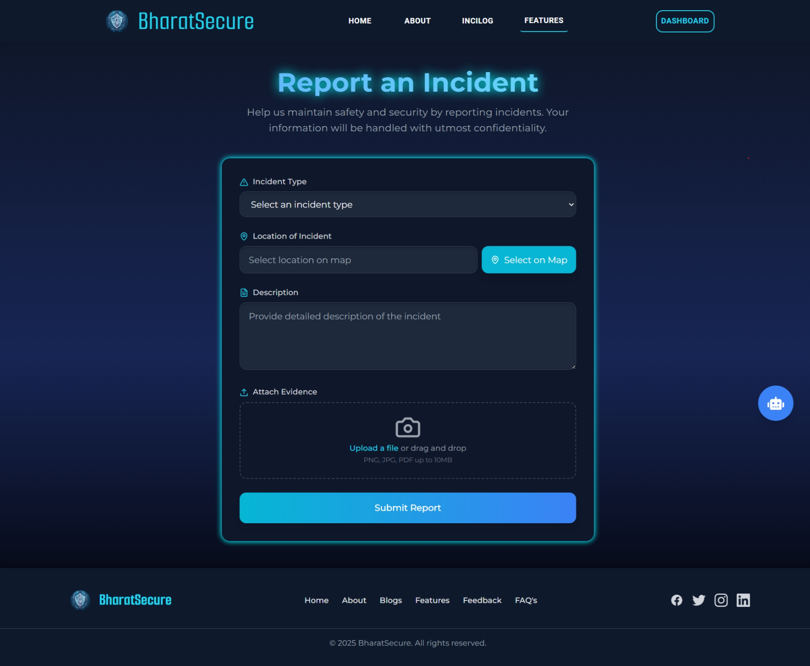
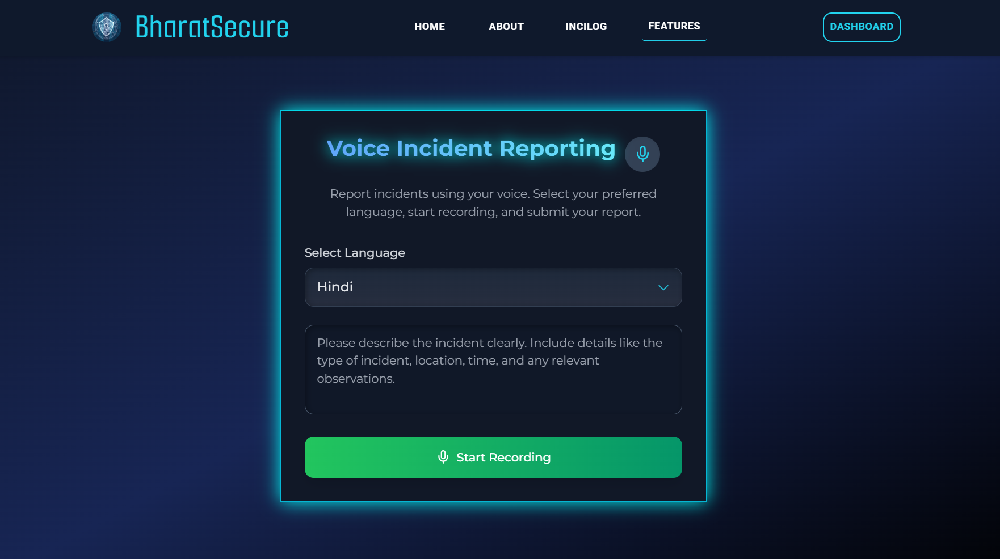
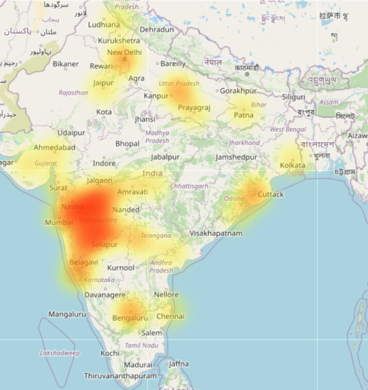
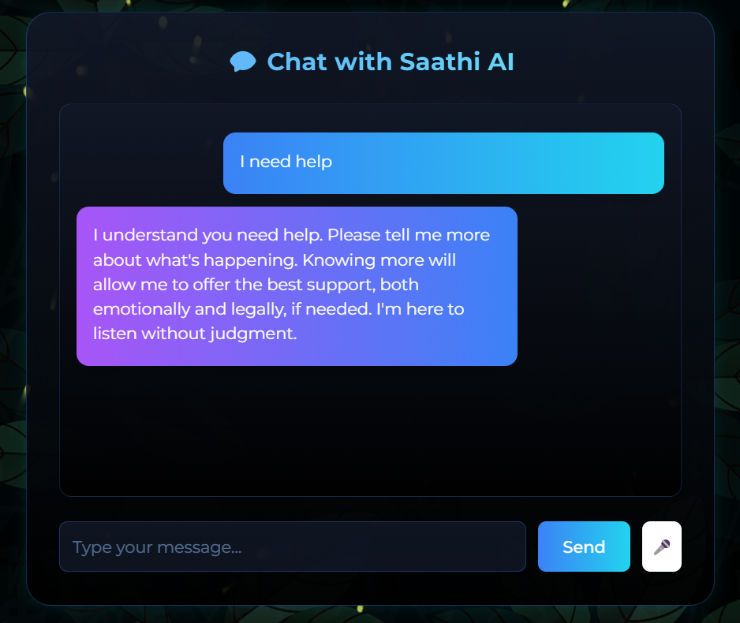
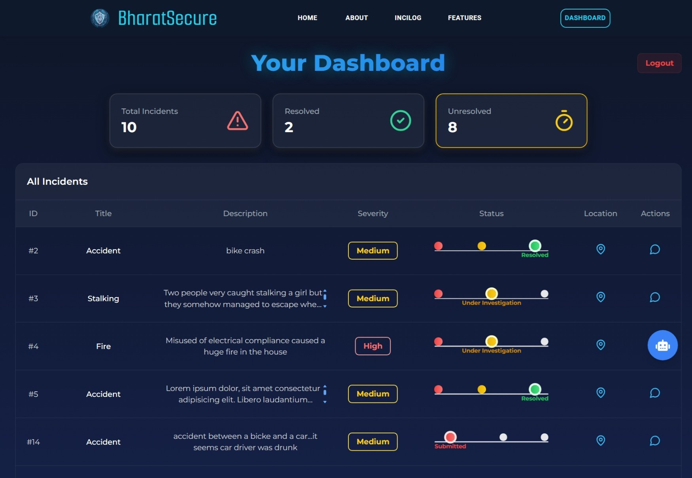

# 🚨 BharatSecure – Incident Reporting & Response System

## 📌 Overview

**BharatSecure** is a fully responsive web-based platform designed to streamline incident reporting and response, ensuring faster, more efficient emergency handling. It empowers users to report incidents via text or voice, provides real-time alerts, safety heatmaps, and facilitates direct communication with authorities.

## ✨ Key Features

- **Inclusive Reporting:** Report incidents using text or voice.
- **Anonymous Reporting:** Users can submit reports without revealing their identity, ensuring privacy and safety.
- **Real-time Alerts:** Instant notifications to relevant authorities (Police stations/ Hospitals/ Fire Stations/ Disaster Relief Stations).
- **Heatmap Analytics:** Visual representation of high-incident zones.
- **End-to-End Tracking:** Monitor incident progress and resolution status.
- **Categorization:** AI-powered classification for faster response prioritization.
- **AI Chatbot Support:** Available 24/7 with:
  - 🧠 **Emotional Support** – Counseling & crisis intervention.
  - ⚖️ **Legal Guidance** – Rights information & reporting procedures.
  - 🏥 **Medical Assistance** – First-aid guidance & health-related support.
- **Emergency SOS Button:** Allows authorities to track the user’s location for 1 minute, marking it as a high-priority case.
- **Universal Accessibility:** Fully responsive design ensures seamless use across all devices—mobile, tablet, and desktop.

## 🎥 Watch It in Action

🔗 [**Click here to watch the demo video**](#)

## 🏗️ Tech Stack

- **🌐 Frontend:** React.js
- **⚙️ Backend:** Django Rest Framework
- **🗄️ Database:** SQLite
- **📍 Geolocation:** GPS-based tracking
- **🤖 AI Integration:** NLP-based chatbot for user support

## 🚀 How It Works

1️⃣ **User reports an incident** using text or voice input.  
2️⃣ **The system processes and categorizes** the report automatically.  
3️⃣ **Authorities receive real-time alerts** with necessary details.  
4️⃣ **Users track the incident status** via an interactive dashboard.  
5️⃣ **The emergency SOS feature** enables location tracking for urgent cases.

## 🎯 BharatSecure’s Competitive Edge

- **✅ Focus on accessibility:** Voice-based reporting makes it more inclusive.
- **✅ AI-powered chatbot:** Provides instant medical, emotional, and legal assistance.
- **✅ Real-time tracking & heatmap analytics:** Enhances transparency and data-driven decision-making.
- **✅ Automatic routing to police stations:** Ensures quick action on reported incidents.
- **✅ Anonymous reporting feature:** Protects the identity of whistleblowers and vulnerable users.

## 🖼️ Gallery

| Interface                        | Screenshot                                     |
| -------------------------------- | ---------------------------------------------- |
| **Home Page**                    |                 |
| **Incident Reporting Interface** |      |
| **Voice Reporting Interface**    |       |
| **Heatmap Analytics**            |                |
| **AI Chatbot**                   |                |
| **User Dashboard**               |  |
| **Admin Dashboard**              |         |

---
